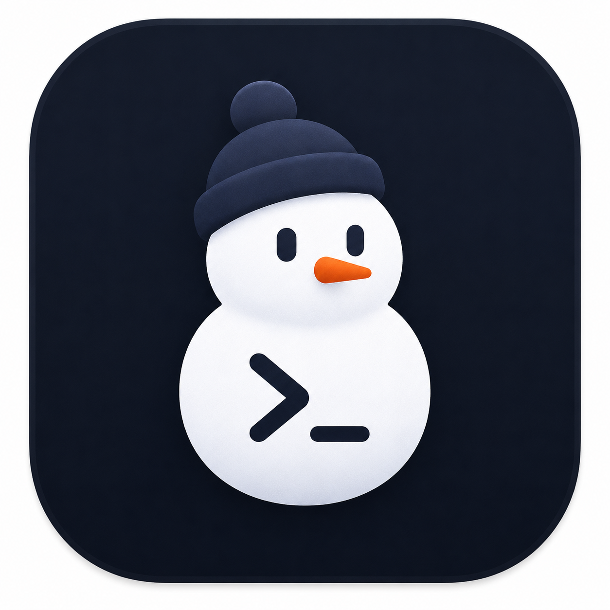
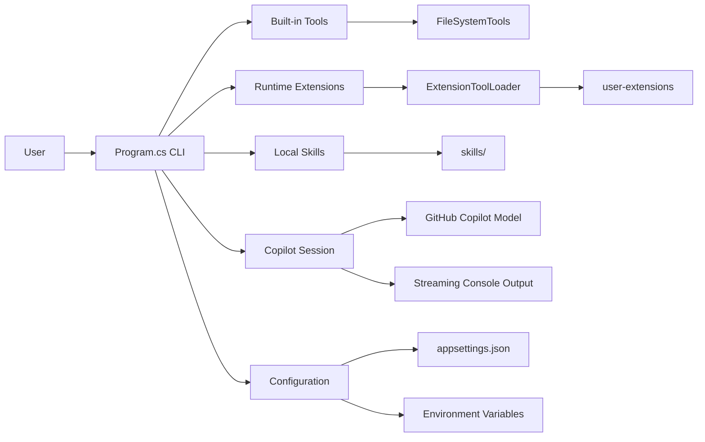
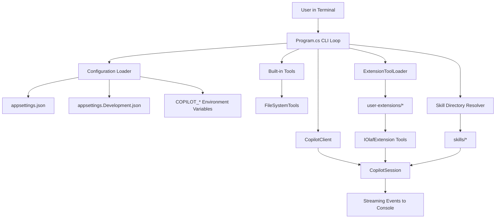

# OLAF

OLAF is a console-based AI coding assistant built on the GitHub Copilot SDK for .NET.



It starts an interactive chat session, streams model responses to the terminal, and supports:

- Built-in local tools (file system exploration)
- Optional runtime extension tools loaded from assemblies
- Optional Markdown skills loaded from a local skills directory
- Session persistence — save, resume, list, and delete named sessions

## Features

- Interactive CLI loop with slash commands
- Streaming assistant output
- Configurable model and system prompt
- Session persistence (save, resume, list, delete named sessions)
- Built-in tools:
  - `read_file`
  - `list_files`
  - `get_current_directory`
- Extension loading from `user-extensions`
- Skill loading from `skills`

## Prerequisites

- .NET 10 SDK (project targets `net10.0`)
- A GitHub token with access to Copilot APIs

## Quick Start

1. Restore and build:

```powershell
dotnet restore
dotnet build
```

2. Configure credentials and runtime settings in `appsettings.json` (or use environment variables).

3. Run:

```powershell
dotnet run --project OLAF.csproj
```

## First-Run Checklist

Use this checklist when setting up OLAF on a fresh machine:

1. Install the .NET 10 SDK.
2. Clone the repository and run `dotnet restore`.
3. Set your GitHub token in `appsettings.json` or as `COPILOT_Copilot__GitHubToken`.
4. Verify extension and skills directories exist (`user-extensions`, `skills`).
5. Run `dotnet run --project OLAF.csproj`.
6. In the CLI, run `/help` and send a simple prompt to confirm responses stream correctly.

## Architecture

This diagram shows the main runtime pieces and how they connect at a high level:





At session start (or after `/clear`), OLAF rebuilds the active toolset by combining built-in tools with successfully loaded extension tools, then creates a new Copilot session with optional skills.

Named sessions created with `/start` persist on disk and can be resumed across application restarts.

## Configuration

Configuration is read from:

1. `appsettings.json`
2. `appsettings.Development.json` (optional)
3. Environment variables prefixed with `COPILOT_`

Main settings (under `Copilot`):

- `Model` (default: `gpt-5`)
- `GitHubToken`
- `EnableExtensions`
- `ExtensionsDirectory` (default: `user-extensions`)
- `EnableSkills`
- `SkillsDirectory` (default: `skills`)
- `SystemPrompt`

Example environment variable for the GitHub token:

```powershell
$env:COPILOT_Copilot__GitHubToken = "<your-token>"
```

## CLI Commands

Inside the running app:

| Command | Description |
|---|---|
| `/help` | Show available commands |
| `/clear` | Start a fresh Copilot session and reload tools |
| `/start <id>` | Start a new named session with the given ID (persisted to disk, resumable later). With no argument, shows the current session ID. |
| `/sessions` | List all saved sessions, marking the currently active one |
| `/resume <id>` | Resume a previously saved named session (restores conversation context) |
| `/delete <id>` | Permanently delete a saved session and all its data |
| `/exit` | Quit the app |

### Session Persistence

Named sessions survive application restarts. Typical workflow:

```
> /start my-project          # start a named session
> Tell me about SOLID       # have a conversation
> /exit                     # close the app

# Later...
> /sessions                 # list saved sessions
> /resume my-project        # pick up exactly where you left off
> What were we discussing?  # context is restored
```

To clean up old sessions:

```
> /delete my-project
```

## Extensions

OLAF can load extension assemblies at runtime when `EnableExtensions` is true.

High-level flow:

1. Assemblies are discovered in `ExtensionsDirectory`
2. Types implementing `IOlafExtension` are loaded
3. Tools returned by `GetTools(...)` are added to the session

### Extension Lifecycle (Detailed)

The extension lifecycle runs during startup and every time `/clear` is used.

1. Discover and prepare
  - Resolve `ExtensionsDirectory` from config (absolute path, or relative to app base directory).
  - Create the directory if it does not exist.
  - Find all `*.cs` files recursively.

2. Compile extension sources
  - Build a dynamic Roslyn compilation from discovered source files.
  - Use `LanguageVersion.Preview` and emit a DLL + portable PDB to memory streams.
  - Reference trusted platform assemblies plus currently loaded runtime assemblies.

3. Handle compile diagnostics
  - Warnings and errors are captured as extension load messages.
  - If compilation fails, no extension tools are loaded for that session.

4. Load assembly in an isolated collectible context
  - Create a collectible `AssemblyLoadContext` (`ExtensionAssemblyLoadContext`).
  - Load the in-memory extension assembly into that context.

5. Discover extension types
  - Scan assembly types that:
    - implement `IOlafExtension`
    - are non-abstract and non-interface
    - have a public parameterless constructor

6. Instantiate and request tools
  - Create each extension instance.
  - Call `GetTools(new ExtensionContributionContext(extensionDirectory))`.
  - Collect returned `AIFunction` tools.
  - Record per-extension info/error messages.

7. Activate session toolset
  - Merge built-in tools with all contributed extension tools.
  - Create a new Copilot session using the merged tool list.

8. Unload previous extension context on refresh
  - Before creating a new session, OLAF disposes the previous `ExtensionToolLoadResult`.
  - Disposal unloads the previous collectible assembly load context.

### Extension Failure Behavior

- No source files: OLAF continues with built-in tools only.
- Compilation warnings: extension may still load; warnings are reported.
- Compilation errors: extension load is skipped for that cycle.
- Runtime errors in `GetTools(...)`: failing extension is skipped; others can still load.
- Assembly/type load failures: reported in startup messages; OLAF remains usable.

### Extension Lifecycle Diagram

```mermaid
flowchart TD
  A[Session start, /clear, /save, or /resume] --> B[Resolve/Create extension directory]
  B --> C[Find *.cs extension sources]
  C --> D[Roslyn compile to in-memory DLL/PDB]
  D --> E{Compilation success?}
  E -- No --> F[Emit diagnostics and continue without extension tools]
  E -- Yes --> G[Create collectible AssemblyLoadContext]
  G --> H[Load dynamic assembly]
  H --> I[Discover IOlafExtension types]
  I --> J[Instantiate each extension]
  J --> K[Call GetTools(context)]
  K --> L[Aggregate AIFunction tools + messages]
  L --> M[Combine built-in + extension tools]
  M --> N[Create Copilot session]
  N --> O[On next /clear: dispose previous load result and unload context]
```

Useful files:

- `Extensions/IOlafExtension.cs`
- `Extensions/ExtensionToolLoader.cs`
- `user-extensions/README.md`
- `skills/create-olafextension-skill.md`

## Skills

When `EnableSkills` is true, OLAF passes configured skill directories to the Copilot session.

By default, skill markdown files are expected under:

- `skills`

## Project Structure

- `Program.cs` App entrypoint and interactive loop
- `Configuration/` Runtime configuration model
- `Tools/` Built-in tool implementations
- `Extensions/` Extension contracts and loader infrastructure
- `skills/` Local skills
- `user-extensions/` Drop-in extension source/sample area

## Troubleshooting

- If extension tools are not available, check startup messages for extension load warnings/errors.
- If model calls fail, verify `GitHubToken` is present and valid.
- If skills are not loaded, verify `EnableSkills` is true and `SkillsDirectory` exists.

